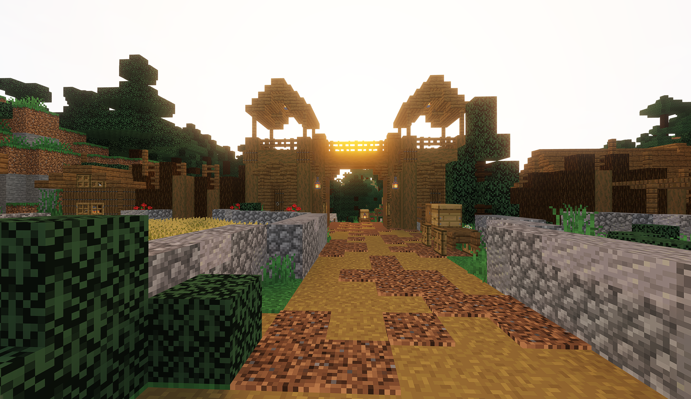
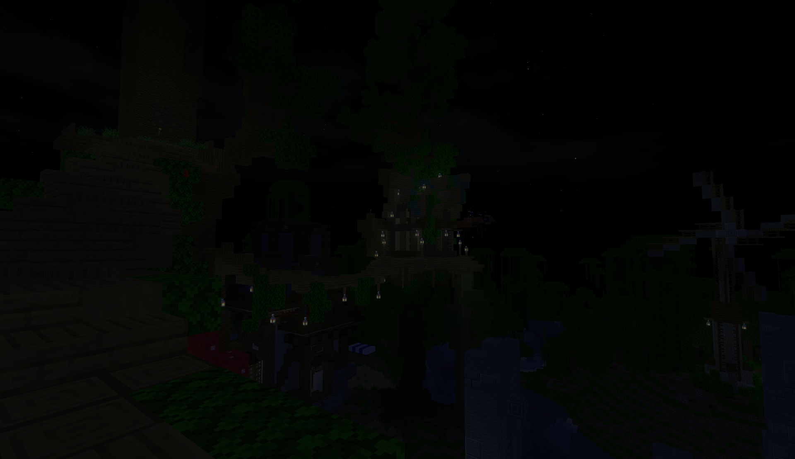
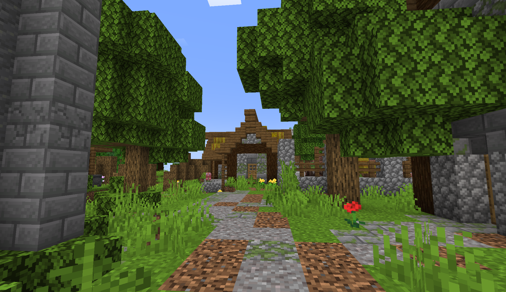
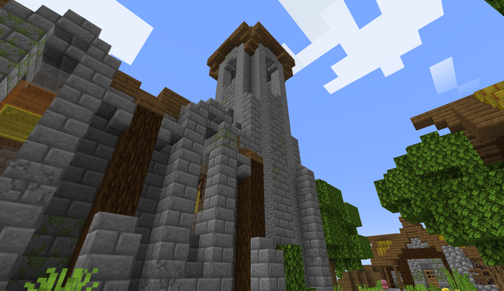
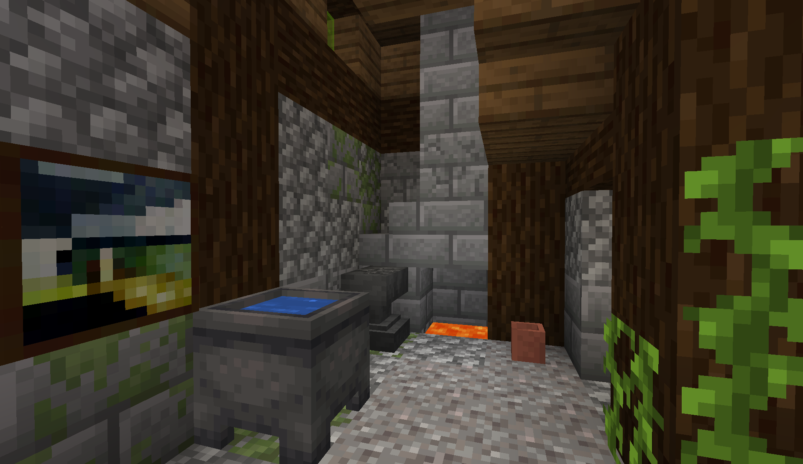

# Minecraft PTGI Shader

This repository presents a shaderpack for Minecraft 1.21 with Iris that implements path traced global illumination (PTGI) and spatiotemporal variance guided filtering ([SVGF](https://research.nvidia.com/publication/2017-07_spatiotemporal-variance-guided-filtering-real-time-reconstruction-path-traced)) for image denoising / reconstruction.

## Shaderpack
<p float="left">
  
  
  
  
  
  
  
  
  
  
  
  
</p>

## Before/After
<p float="left">
  
  
  
  
  
  
  
  
  
  
</p>

## Features
- Path traced global illumination (PTGI)
- Spatiotemporal variance guided filtering (SVGF)
- Temporal Anti-Aliasing (TAA)
- Temporal reprojection & motion buffers
- Upscaling
- Sky
- Volumetric clouds
- Day/night cycle
- Bloom
- Weather and raining
- Tonemapping
- Gamma correction

## TODO
This shader is not finished but may be of use to anyone who wants to grab parts of the pipeline for their own project or enhance the visuals of this shader.

- Better TAA with motion buffers
- Increase ray tracer performance / efficiency (e.g. MIS)

The shader contains multiple bugs and exhibits weird behavior sometimes especially when there is little light which makes the denoiser go crazy and flicker the pixels.

## How it works
The main feature of this shaderpack is path tracing global illumination which computes lighting in a realistic way by tracing rays through the scene and bouncing them until they hit a light source. This shader shows a hybrid renderer based on OpenGL. In order to keep world data around for path tracing I use voxelization by hijacking the shadow pass to compute a voxel map that stores the 3D world blocks into a 2D texture using uniform grids. We can ray trace this texture later in the pipeline at shading time in fullscreen passes. In order to smooth path tracing results, SVGF helps reduce noise by filtering across space and time the global illumination buffer (ray traced results without albedo / textures) to output a smooth image. TAA is used at the end of the pipeline to remove unwanted aliasing artifacts near the edges.

## Installation
- Install [Iris here](https://www.irisshaders.dev/)
- Go to ```.minecraft``` folder
- Place the shaderpack inside the folder ```shaderpacks```

## Requirements
- Iris
- Minecraft 1.21
- NVIDIA GPU

You do not need a RTX graphics card to run this shader. Feel free to take this shader or part of it for use in your projects. This shaderpack does not work on Apple Silicon MacBooks because geometry shaders are not supported.

## Credits
- [Clouds](https://www.shadertoy.com/view/MdGfzh)
- [SVGF](https://research.nvidia.com/publication/2017-07_spatiotemporal-variance-guided-filtering-real-time-reconstruction-path-traced) 
- [Voxelization](https://github.com/coolq1000/vx-simple) 
- [Bloom](https://www.shadertoy.com/view/lsBfRc)