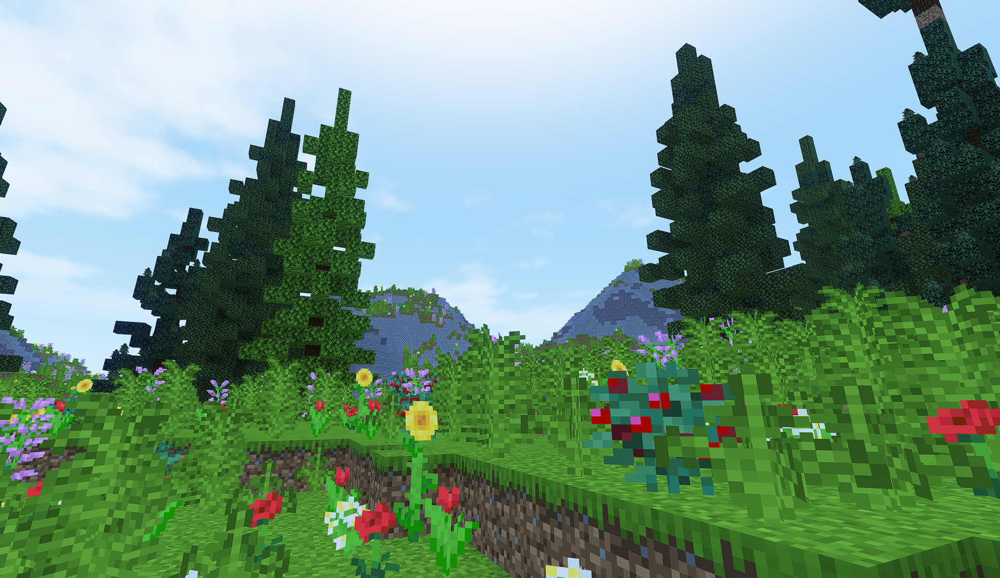
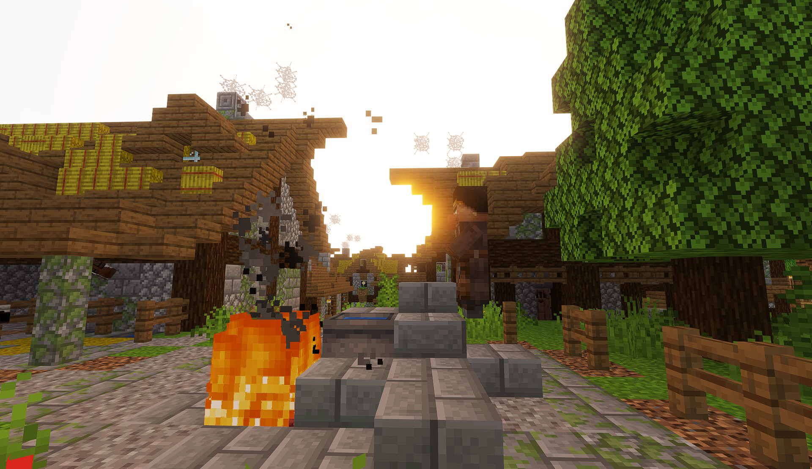
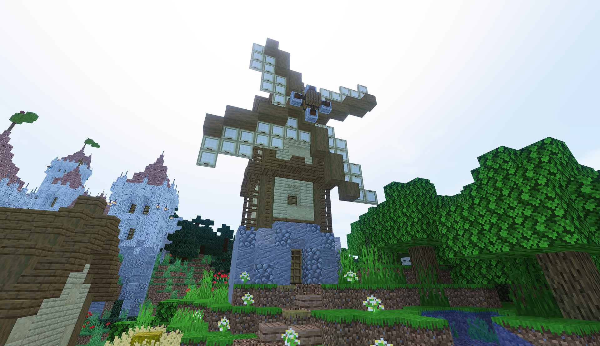
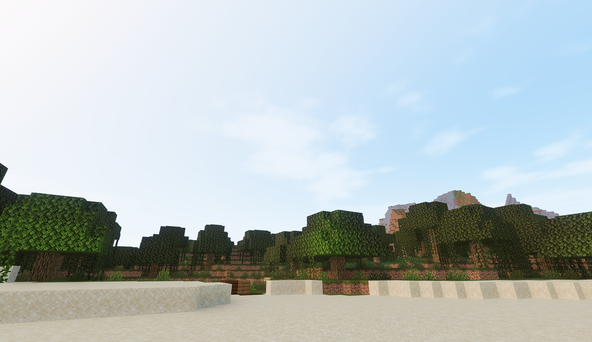
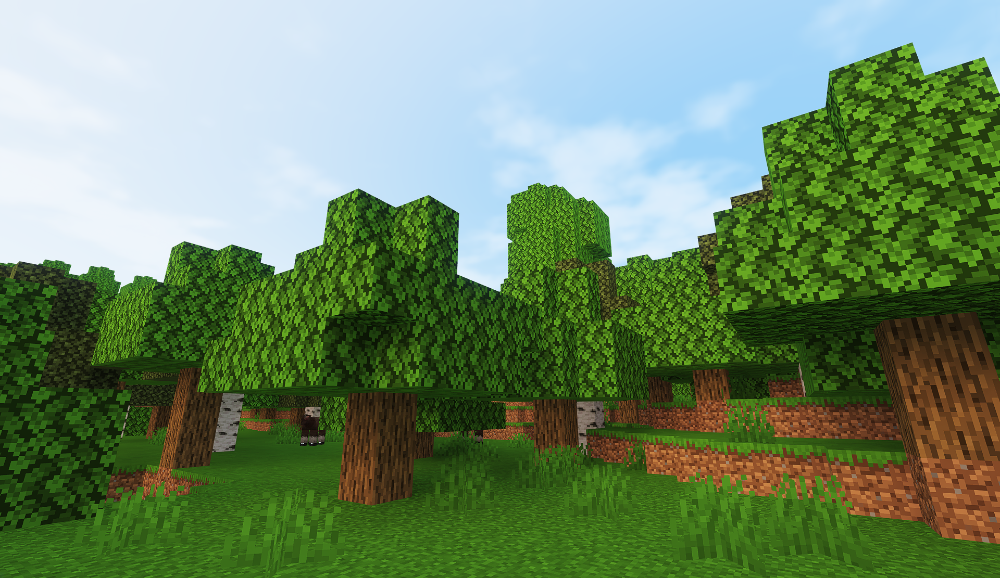
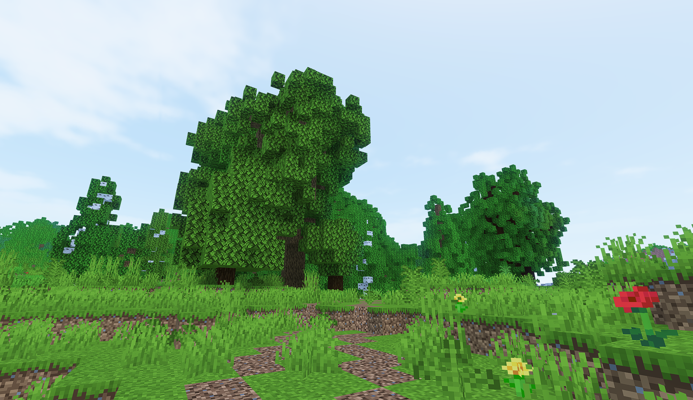
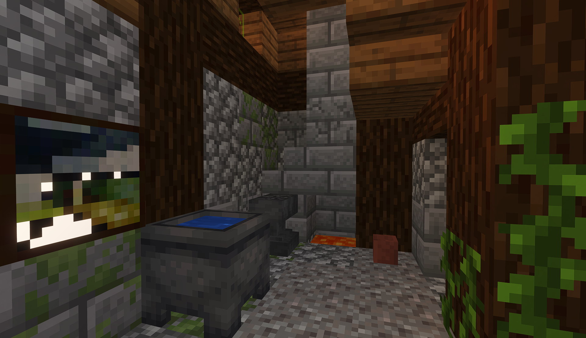

# Minecraft PTGI Shader

This repository presents a shaderpack for Minecraft 1.21 with Iris that implements path traced global illumination (PTGI) and spatiotemporal variance guided filtering ([SVGF](https://research.nvidia.com/publication/2017-07_spatiotemporal-variance-guided-filtering-real-time-reconstruction-path-traced)) for image denoising / reconstruction.

## Shaderpack
<p float="left">
  
  
  
  
  
  
  
  
  
  
  
  
</p>

## Before/After
<p float="left">
  
  
  
  
  
  
  
  
  
  
  
  
  
  
  
  
</p>

## Features
- Path traced global illumination (PTGI)
- Spatiotemporal variance guided filtering (SVGF)
- Temporal Anti-Aliasing (TAA)
- Temporal reprojection & motion buffers
- Upscaling
- Motion blur
- Sky
- Volumetric clouds
- Day/night cycle
- Bloom
- Weather and raining
- Animated vegetation
- Color grading
- Tonemapping
- Gamma correction

## TODO
This shader is not finished but may be of use to anyone who wants to grab parts of the pipeline for their own project or enhance the visuals of this shader.

- Better TAA with motion buffers
- Increase ray tracer performance / efficiency (e.g. MIS)

The shader contains multiple bugs and exhibits weird behavior sometimes especially when there is little light which makes the denoiser go crazy and flicker the pixels. Level of details could improve issues when you look far away and the blocks flicker because of aliasing in the ray buffer. The brute force way to solve this issue is increasing the number of rays. Another weird bug happens when travelling far away from the spawn (0, 0, 0), the blocks become dark, I have no idea why, but it comes from the path tracer, very likely the position buffer. You can run the shader with 1 sample per pixel (1 SPP) and 2 bouces for the cost of flickering at grazing angles and on farway blocks. 6 SPP and 4 bounces create a very clean result with almost no noise visible.

## How it works
The main feature of this shaderpack is path tracing global illumination which computes lighting in a realistic way by tracing rays through the scene and bouncing them until they hit a light source. This shader shows a hybrid renderer based on OpenGL. In order to keep world data around for path tracing I use voxelization by hijacking the shadow pass to compute a voxel map that stores the 3D world blocks into a 2D texture using uniform grids. We can ray trace this texture later in the pipeline at shading time in fullscreen passes. In order to smooth path tracing results, SVGF helps reduce noise by filtering across space and time the global illumination buffer (ray traced results without albedo / textures) to output a smooth image. TAA is used at the end of the pipeline to remove unwanted aliasing artifacts near the edges.

## Installation
- Install [Iris here](https://www.irisshaders.dev/)
- Go to ```.minecraft``` folder
- Place the shaderpack inside the folder ```shaderpacks```

## Requirements
- Iris
- Minecraft 1.21
- NVIDIA GPU

You do not need a RTX graphics card to run this shader. Feel free to take this shader or part of it for use in your projects. This shaderpack does not work on Apple Silicon MacBooks because geometry shaders are not supported.

## Credits
This shader has been heavily inspired by Sonic Ether's video on path traced global illumination for SEUS in Minecraft. However, this shaderpack does not borrow any code line from the SEUS shader.

[](https://www.youtube.com/watch?v=7MV26bOSAyk "SEUS PTGI in Minecraft")

I would also like to thank [coolq1000](https://github.com/coolq1000) without whom this shader would have never existed.

### Code
- [Clouds](https://www.shadertoy.com/view/MdGfzh)
- [SVGF](https://research.nvidia.com/publication/2017-07_spatiotemporal-variance-guided-filtering-real-time-reconstruction-path-traced)
- [Voxelization](https://github.com/coolq1000/vx-simple) 
- [Bloom](https://www.shadertoy.com/view/lsBfRc)
- [TAA](https://modrinth.com/shader/taa)
- [TAA](https://modrinth.com/shader/vanillaa)
- [Motion Blur](https://modrinth.com/shader/motion-blur-fx)
- [Waving Plants](https://www.9minecraft.net/waving-plants-shaders-mod/)

### Maps
- [Epic Medieval Town](https://www.9minecraft.net/epic-medieval-town-map/#Epic_Medieval_Town_Map_1214_1201_Download_Links)
- [Epic Moutain Village](https://www.9minecraft.net/epic-mountain-village-map/#Epic_Mountain_Village_Map_1214_1201_Download_Links)
- [The Merchant Pass](https://www.9minecraft.net/the-merchants-pass-map/#The_Merchants_Pass_Map_1214_1201_Download_Links)
- [Survival Island](https://www.9minecraft.net/survival-island-map-2/#Survival_Island_Map_1214_1201_Download_Links)
- [Jungle Village](https://www.9minecraft.net/custom-jungle-village-map/#Custom_Jungle_Village_Map_1211_1201_Download_Links)
- [Tiny Palm Island](https://www.9minecraft.net/tiny-palm-island-map/#Tiny_Palm_Island_Map_1214_1201_Download_Links)

### Packs
- [Cotterie Craft](https://www.9minecraft.net/coterie-craft-resource-pack/)